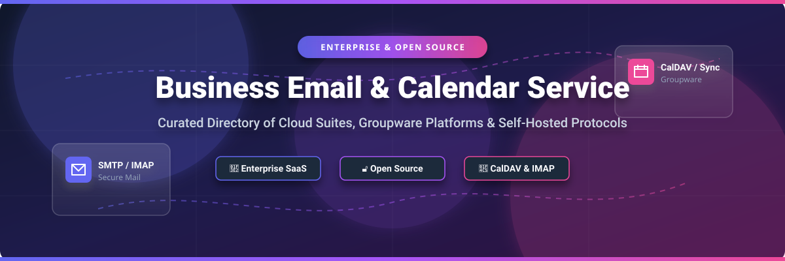

# Awesome-Business-Email-Calendar-Service

# Awesome-Browser-Based-Command-Line-Interface 💻 🌐

  

  
  
  
  
  
  

---

## 🌟 Top Browser-Based Command Line Interface Ecosystem

**Curated List of Commercial Cloud Shells & Open-Source Web Terminal Frameworks**  
*Focused on Browser-Based Terminals, Cloud Development Environments, Self-Hosted Shell Gateways & Containerized Workspace Streaming*  

**Last updated: October 2026** 📅

---

### 📌 Overview & SEO Summary
Welcome to the ultimate curated directory of **browser-based command line interfaces**, **cloud development environments**, and **open-source web terminal frameworks**. Whether you are looking for enterprise-grade commercial solutions (such as *AWS CloudShell*, *Google Cloud Shell*, and *GitHub Codespaces*), or self-hostable open-source alternatives (like *Kasm Workspaces*, *termview*, and *tunnelterm*), this list covers category leaders, containerized workspace streaming, and privacy-respecting terminal gateways.

---

## 📑 Table of Contents
- [🏢 SaaS & Commercial Platforms](#-saas--commercial-platforms)
- [🔓 Open-Source GitHub Projects](#-open-source-github-projects)
- [🛠️ How to Contribute](#%EF%B8%8F-how-to-contribute)
- [📊 Star History](#-star-history)
- [🤝 Support & Sponsorship](#-support--sponsorship)
- [⚠️ Disclaimer](#%EF%B8%8F-disclaimer)

---

## 🏢 SaaS / Commercial Platforms

The browser-based command line interface market is split between free cloud provider shells (AWS, Google, Azure) and paid cloud development environments (Codespaces, Gitpod, Replit). Cloud shells are **free to use** — you only pay for the resources you create through them [citation:6][citation:18]. Cloud development environments charge based on core-hours or monthly subscriptions. **Gitpod Classic sunset its pay-as-you-go tier on October 15, 2025**, and the product has been renamed to Ona [citation:21][citation:32].

| SaaS / Commercial Platform | Company / Owner | Valuation / Market Cap | Standard Edition Starting Price | Free Tier / Free Trial Limits | Description |
| :--- | :--- | :--- | :--- | :--- | :--- |
| **[AWS CloudShell](https://aws.amazon.com/cloudshell/)** ☁️ | Amazon | ~$2.0 Trillion | **Free service**; pay only for AWS resources created [citation:6] | **Free forever** — 1 GB persistent storage per region, 10 concurrent sessions [citation:1] | **Browser-based Linux terminal in AWS Console** — Pre-authenticated with console credentials. Pre-installed: AWS CLI v2, Bash, zsh, PowerShell, vim, Git, npm, pip. Upload/download files up to 1 GB. Amazon Linux 2 [citation:1]. |
| **[Google Cloud Shell](https://cloud.google.com/shell)** 🌐 | Google (Alphabet) | ~$2.0 Trillion | **Free service**; pay only for GCP resources created | **Free: 5 GB persistent storage, 60 hours/week limit** [citation:19] | **GCP terminal with full IDE** — Debian-based. Pre-installed: gcloud, kubectl, Terraform, Docker, Java, Go, Python, Node.js. Eclipse Theia-based code editor built in. Web Preview for local endpoints [citation:13]. |
| **[Azure Cloud Shell](https://azure.microsoft.com/en-us/products/cloud-shell/)** 🔷 | Microsoft | ~$3.90 Trillion | **Free service**; pay only for storage account and Azure resources [citation:8] | **Free: 5 GB persistent storage**, 20 concurrent sessions per tenant [citation:23] | **Azure terminal (Bash or PowerShell)** — Ubuntu-based. Pre-installed: Azure CLI, PowerShell, Terraform, Docker, Git. Sessions timeout after 20 minutes idle [citation:34]. |
| **[GitHub Codespaces](https://github.com/features/codespaces)** 🐙 | Microsoft / GitHub | ~$3.90 Trillion | **$0.18/core-hour** (2-core); storage $0.07/GB-month | **Free: 120 core-hours/month + 15 GB storage** [citation:9] | **Full VS Code in the browser** — Dev Container support, extensions, terminal, port forwarding. 2-core machine: ~60 real hours/month. 4-core: ~30 real hours [citation:9][citation:30]. **The best web-based code editor** [citation:14]. |
| **[Gitpod (now Ona)](https://ona.com/)** 🦊 | Ona (formerly Gitpod) | Private | **Gitpod Classic PAYG sunset Oct 15, 2025** [citation:21] | **Classic sunset**; new Ona platform pricing TBD | **Cloud development environments** — Automates provisioning of ready-to-code environments. VS Code in browser. **Classic product discontinued**; migrating to Ona [citation:32]. |
| **[Replit](https://replit.com/)** 🎮 | Replit Inc. | Private | **Core: $20/month** ($204/year) | **Starter: free** with daily Agent allowance, 1 published app [citation:11] | **Browser-based IDE with AI Agent** — Core includes $20 monthly credits, 1 parallel Agent task, 5 collaborators, unlimited published apps. Great for **rapid prototypes, scripts, Python, ML demos, teaching** [citation:14]. |
| **[StackBlitz](https://stackblitz.com/)** ⚡ | StackBlitz | Private | **Enterprise: custom** (on-prem or VPC) [citation:15] | **Free for individuals**; no permanent free tier for teams | **Browser-based IDE for web development** — Runs Node.js entirely in browser via WebContainers. **Best for Web services and frontend page debugging** [citation:2]. Enterprise supports private NPM registries and SSO [citation:15]. |
| **[Daytona](https://www.daytona.io/)** 🏎️ | Daytona | Private | **Pay-as-you-go: $0.0504/vCPU-hour**, $0.0162/GiB-hour [citation:12] | **$200 free compute credit on signup** [citation:12] | **Usage-based cloud development environments** — Per-second billing. **Sub-90ms sandbox cold starts** [citation:12]. SDKs for Python, TypeScript, Ruby, Go, Java. Startups program: up to **$50K free credits** [citation:12]. |
| **[Codeanywhere](https://codeanywhere.com/)** 📦 | Codeanywhere | Private | **SaaS: custom per-user** | **Free tier available** | **Cloud-based IDE with collaboration** — Supports FTP, GitHub, Dropbox file sources. Collaborative editing, embeddable environments. 16+ years in market. Works with Infobip, Mindsmiths [citation:15]. |
| **[Kasm Workspaces](https://kasm.com/)** 🐳 | Kasm Technologies | Private | **Community Edition: Free**; Professional: $10/user/month [citation:4] | **Community Edition: free forever** (5 concurrent sessions) [citation:4] | **Containerized workspace streaming** — Streams desktops, browsers, and apps to any browser. **Open-source web-native rendering technology** [citation:4]. Web Isolation and App Streaming. DevSecOps-enabled. Partnership with SUSE Virtualization [citation:16]. |

---

## 🔓 Open-Source GitHub Projects

*Sorted by GitHub_Stars_Count (Descending)* 🌟

- **[Kasm Workspaces Community Edition](https://github.com/kasmtech/workspaces-images)**   
  **Containerized workspace streaming platform**, free Community Edition. **5 concurrent sessions**, unlimited users. **Open-source web-native rendering technology** — streams Docker-based desktops, browsers, and applications to any browser [citation:4]. No VPN or client install required. **All Workspaces images and streaming technology open-source** on Docker Hub and GitHub [citation:4]. SSO/2FA, DLP, security groups, logging, and web filtering. **Partnership with SUSE Virtualization** for Kubernetes-native infrastructure [citation:16]. 🐳

- **[termview](https://github.com/javy99/termview)**   
  **Share any terminal in the browser**, MIT licensed. **Go + PTY + WebSockets + xterm.js** [citation:5]. Run anything that works in a terminal: Bash, Python, Go, REPLs, scripts, compiled apps. **Single command**: `./termview bash` → open `http://localhost:8080` [citation:5]. **Use cases: live coding interviews, teaching Python/Bash/Go remotely, remote debugging, web-based REPL** [citation:5]. 🔧

- **[tunnelterm](https://pypi.org/project/tunnelterm/)**   
  **Secure browser terminal over HTTP/WebSocket**, open-source. **Password authentication required** (`TUNNELTERM_PASSWORD`). **TOTP second factor** optional (Google Authenticator, 1Password, Authy) [citation:24]. Session idle timeout configurable (default: 18000 seconds/5 hours). **nginx reverse proxy with HTTPS** for non-loopback deployments. systemd service included. **CWE-532 compliant** — session tokens truncated in logs [citation:24]. 🔒

- **[tailmux](https://github.com/adamcowan/tailmux)**   
  **Browser-based terminal with tmux integration**, open-source. **Multi-tab support**, mobile optimization with virtual keyboard. **tmux integration**: attach to existing sessions or create new persistent sessions that survive disconnects [citation:35]. **Designed for private networks** — recommends Tailscale or VPN. **Important: no authentication by default** unless `TAILMUX_TOKEN` is set [citation:35]. 🛡️

- **[web-terminal-engine](https://github.com/cplieger/web-terminal-engine)**   
  **Go-based web terminal engine**, open-source. **Server-side session management** with status derivation (working/idle/failed/warning/exited/crashed) from OSC 9;4 progress reports [citation:37]. **Secondary activity channel** for background tasks (`working`, `waiting`, `input`). **Shared tab order** across clients — reorder in one browser moves tabs in all browsers [citation:37]. TERM=xterm-256color, COLORTERM=truecolor for truecolor detection. 🎛️

- **[Terminal-HTML](https://github.com/builtbyashwin/Terminal)**   
  **Minimal dummy Linux terminal emulator**, GPL-3.0 licensed. **Pure HTML/CSS/JS** — no server required. **Fake filesystem** with commands: `help`, `ls`, `cd`, `mkdir`, `pwd`, `whoami`, `rmdir` [citation:17]. **Perfect for learning, practicing basic Linux commands, or fun**. Fully client-side, works in any modern browser. 🔰

- **[ptylon](https://www.npmjs.com/package/ptylon)**   
  **Self-hosted browser-native terminal workspace**, MIT licensed. **"Termius in a browser tab"** [citation:29]. **Persistent terminals, server-rendered browser tabs, split panes, workspaces, file manager, Monaco editing, theme gallery**. Docker Compose or systemd deployment. **Reserves npm name but is not an npm dependency** — install from repository [citation:29]. 🚀

---

## 🛠️ How to Contribute

Contributions are welcome! Follow these steps to submit new browser-based CLI platforms or open-source web terminal software:

1. 🍴 **Fork** the repository.
2. 📝 **Add/edit** entries in `README.md` maintaining table/list structure and formatting.
3. 🔗 Include project title, official website/GitHub link, exact Stars_Count, license, and brief description.
4. 🚀 Submit a **Pull Request** with a descriptive summary of your changes.

---

## 📊 Star History

---

## 🤝 Support & Sponsorship

If you find this browser-based command line interface repository useful, please consider supporting the project:

- ⭐ **Star** this repository to increase visibility!
- 🔀 **Fork** and share with fellow developers, DevOps engineers, and open-source advocates.
- ☕ **Sponsor & Buy Me a Coffee**: Support ongoing open-source curation via the [GitHub Sponsor Dashboard](https://github.com/sponsors/ishandutta2007).

---

## ⚠️ Disclaimer

- This is a **community-curated** list — not exhaustive and not an endorsement. ℹ️
- **Gitpod Classic pay-as-you-go sunset on October 15, 2025** — existing users should plan migration to Ona or alternative platforms [citation:21][citation:32].
- Browser-based shells execute real commands with your credentials. **Review authentication, network isolation, and session timeout settings** before deploying. Tailmux explicitly warns that it has **no authentication by default** unless `TAILMUX_TOKEN` is set [citation:35]. Azure Cloud Shell has a **20 concurrent session limit per tenant** and times out after 20 minutes idle [citation:23]. AWS CloudShell provides **10 concurrent sessions per region** and 1 GB persistent storage [citation:1]. 🔒
- Open-source solutions (Kasm Workspaces, termview, tunnelterm) provide self-hosted ownership and transparency, but enterprise-grade SLA guarantees, 24/7 support, and managed infrastructure remain primarily commercial offerings. 🌐

---

  <b>Made with ❤️ for developers, DevOps engineers, and open-source cloud workspace advocates.</b>

